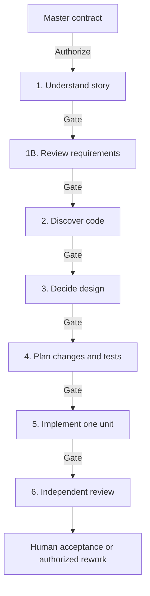

# Developer workflow

[Home](Home.md) · [Developer workflow](Developer-Workflow.md)

**Status:** Draft for team review | **BMAD baseline:** 6.12.0 | **Reviewed:** September 20, 2026

## Daily use

For analysis, design, testing, or delivery support outside a developer phase, use the [role-specific starters](Role-Guides.md). Their trial prompts do not authorize this developer workflow.

This is the control page for the developer phases. Start with the [master](Master-Template.md), fill one phase card, and review its output before approving. The six numbered phases and Phase 1B are our enterprise mapping. A phase card explicitly selects its documented enterprise procedure; it does not automatically launch a full native BMAD workflow.

## Phase navigation

See [Agents](Agents.md) for each role's capabilities, best uses, required context, and examples. The table below assigns responsibilities within this workflow.

| Phase | Lead | Reviewable output |
| --- | --- | --- |
| [1 — Story understanding](Phase-1-Story-Understanding.md) | Mary, Analyst | `01-requirements-analysis.md` |
| [1B — Requirements review](Phase-1B-Requirements-Review.md) | John, Product Manager | `01b-requirements-readiness-review.md` |
| [2 — Codebase discovery](Phase-2-Codebase-Discovery.md) | Amelia, Developer | `02-current-state-analysis.md` |
| [3 — Design](Phase-3-Design.md) | Winston, Architect; Sally for UX questions | `03-design-decision.md` |
| [4 — Implementation planning](Phase-4-Implementation-Planning.md) | Amelia | `04-implementation-plan.md` |
| [5 — Implement one unit](Phase-5-Implementation.md) | Amelia | `05-unit-<UNIT>-implementation-log.md` and authorized code/tests |
| [6 — Independent review](Phase-6-Independent-Review.md) | Separate review session | `06-review-<REVIEW-ID>.md` |

The five BMM roles are Mary, John, Winston, Amelia, and Sally. Amelia includes a QA capability; the broader Test Architect module is separate. Use supporting roles for a specific question, not automatically on every story. [6.12.0 agent catalog](https://github.com/bmad-code-org/BMAD-METHOD/blob/v6.12.0/docs/reference/skills-and-agents.md)

## Flow

Every **Gate** means stop, human review, approval of an exact revision, and separate authorization for the next action. Text equivalent: Master → 1 → 1B → 2 → 3 → 4 → 5 → 6 → human acceptance.

Repeat 5 and 6 for additional authorized units. A unit review is not automatically whole-story acceptance; the final Phase 6 review covers every AC and integration across units. Delivery actions such as commits, pull requests, deployments, and Rally updates require their own authorization.

## Fill the card before pasting

- Replace every angle-bracket placeholder; use `NONE` when an optional permission is unused.
- Resolve `<STORY-DIR>` once using the project's verified artifact convention, or `_bmad-output/<RALLY-ID>` if none exists. Reuse the exact resolved path in every card and approval.
- Name the original Rally source revision or approved snapshot and the approved input revisions. Link only materials relevant to the phase.
- For Phase 5, enumerate production, test, and configuration paths. Do not authorize an entire repository.
- For tests or runtime-dependent agent activation, name commands, environment, and generated-output paths. Default preparation covers read-only inspection, not installing tools.

The cards permit their named artifact while prohibiting unrelated writes. Handoffs are returned in chat unless another path is explicitly authorized. [Approval and resume examples](Approvals-and-Handoffs.md).

## Native BMAD compatibility

Stock Build can proceed into implementation and later commit. Stock code review can change story and tracking files. A persona name or a no-write sentence does not reconfigure those workflows. These cards define bounded enterprise procedures using BMAD roles; adopting a native skill requires a tested compatible profile and its exact allowed outputs. [Build planning](https://github.com/bmad-code-org/BMAD-METHOD/blob/v6.12.0/src/bmm-skills/ship/bmad-build/step-02-plan.md), [Build completion](https://github.com/bmad-code-org/BMAD-METHOD/blob/v6.12.0/src/bmm-skills/ship/bmad-build/step-05-present.md), [review effects](https://github.com/bmad-code-org/BMAD-METHOD/blob/v6.12.0/src/bmm-skills/ship/bmad-code-review/steps/step-04-present.md)

## Keep it efficient

Use [Sonnet-first defaults](Models-and-Credit-Efficiency.md), reuse verified artifacts, and send only the current card. A fresh session receives the master plus approved references and the active card, not the entire chat history. Keep required repository investigation and review evidence intact.
